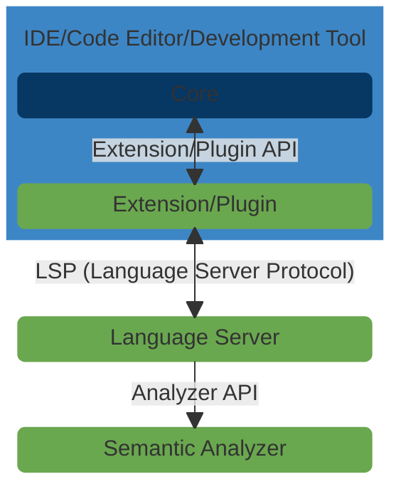

#  ink! analyzer

A collection of modular and reusable libraries and tools for semantic analysis of [ink!] smart contracts.

ink! analyzer aims to improve [ink!] language support in [integrated development environments (IDEs)][IDE], 
[source code editors][editor] and other development tools by providing modular and reusable building blocks 
for implementing features like diagnostics, code completion, code/intent actions, inlay hints, signature help 
and hover content for the [ink! programming language][ink!] - 
which is used for writing smart contracts for blockchains built with [Substrate][substrate].

- [Introductory blog post](https://analyze.ink/blog/introducing-ink-analyzer).

[ink!]: https://use.ink/
[IDE]: https://en.wikipedia.org/wiki/Integrated_development_environment
[editor]: https://en.wikipedia.org/wiki/Source-code_editor
[substrate]: https://substrate.io/

## Architecture



This repository contains 4 main crates:

### 1. [Semantic Analyzer (ink-analyzer)][analyzer]

This crate implements utilities for performing semantic analysis of ink! smart contract code.
It therefore implements the core functionality of ink! analyzer at a high level.

It currently implements an [Analysis][analysis] entry point that accepts a string representation (`&str`) of ink! smart contract code as input and defines associated methods that compute:

- [diagnostics] - errors and warnings based on ink! semantic rules.
- [quickfixes][diagnostics] - suggested edits/code actions for diagnostic errors and warnings.
- [completions] - completion suggestions for ink! attribute macros, arguments and entities/items.
- [code/intent actions][actions] - contextual assists for:
  - adding relevant ink! attribute macros, arguments and entities/items
  - migrating ink! projects to newer versions of ink! (e.g. ink! 4.x to 5.0)
  - extracting ink! entities (e.g. ink! 5.0 events) into standalone packages
  - and more!
- [inlay hints] - inline type and format information for ink! attribute arguments values
  (e.g. `u32 | _ | @` for ink! message selectors).
- [signature help] - popup information for valid ink! attribute arguments for the current context/cursor position.
- [hover content][hover] - descriptive/informational text for ink! attribute macros and arguments.

[analyzer]: /crates/analyzer
[analysis]: /crates/analyzer/src/analysis.rs
[diagnostics]: /crates/analyzer/src/analysis/diagnostics.rs
[completions]: /crates/analyzer/src/analysis/completions.rs
[actions]: /crates/analyzer/src/analysis/actions.rs
[inlay hints]: /crates/analyzer/src/analysis/inlay_hints.rs
[signature help]: /crates/analyzer/src/analysis/signature_help.rs
[hover]: /crates/analyzer/src/analysis/hover.rs

### 2. [Language Server (ink-lsp-server)][lsp-server]

This crate implements the [Language Server Protocol (LSP)][LSP] and acts as a backend 
that provides language support features like diagnostic errors, code completion suggestions, 
code/intent actions, inlay hints, signature help and hover content to IDEs, code editors 
and other development tools.

It uses the [semantic analyzer][analyzer] as the engine for providing ink! language support features by:
- translating LSP requests into semantic analyzer interface calls.
- translating semantic analysis results into corresponding LSP types.

It additionally uses [rust-analyzer]'s [lsp-server][ra-lsp-server] crate to handle LSP protocol handshaking 
and parsing messages, and the [lsp-types][lsp-types] crate for LSP type definitions.

Its compiled binary can be used with any [LSP client][LSP-client] that can be configured 
to launch an LSP server using an executable command (i.e. the path to the `ink-lsp-server` binary) 
and can use stdio (standard in/standard out) as the message transport.

[rust-analyzer]: https://github.com/rust-lang/rust-analyzer
[lsp-server]: /crates/lsp-server
[LSP]: https://microsoft.github.io/language-server-protocol/
[ra-lsp-server]: https://docs.rs/lsp-server/latest/lsp_server/
[lsp-types]: https://docs.rs/lsp-types/latest/lsp_types/
[LSP-client]: https://microsoft.github.io/language-server-protocol/implementors/tools/

### 3. [IR (ink-analyzer-ir)][ir]

This crate implements types, abstractions and utilities for parsing ink! smart contract code 
into ink! intermediate representations (IRs) and abstractions.

It implements types and abstractions for all ink! entities (e.g. contracts, storage, events, topics, impls, 
constructors, messages, selectors, tests, trait definitions, chain extensions, storage items e.t.c).

It uses [rust-analyzer]'s [ra_ap_syntax] crate for generating the syntax tree
of the ink! smart contract code that it then converts into ink! entity intermediate representations and abstractions.

The [ra_ap_syntax] crate is used (instead of other Rust parsing and syntax tree libraries) 
because ink! analyzer has similar [design goals][goals] to rust-analyzer.
The most important being that parsing should be:
- resilient (even if the input is invalid, parser tries to see as much syntax tree fragments in the input as it can).
- lossless (even if the input is invalid, the tree produced by the parser represents it exactly).

It's the main dependency for the [semantic analyzer][analyzer] crate.

[ir]: /crates/ir
[ra_ap_syntax]: https://docs.rs/ra_ap_syntax/latest/ra_ap_syntax/
[goals]: https://github.com/rust-lang/rust-analyzer/blob/master/docs/dev/syntax.md#design-goals

### 4. [Proc-macros (ink-analyzer-macro)][proc-macro]

This crate implements procedural macros used primarily by the [ink-analyzer-ir][ir] crate.

[proc-macro]: /crates/macro

## Installation and Usage

Check the readme of each crate for installation and usage instructions and links to documentation.

- Semantic Analyzer: [/crates/analyzer][analyzer]
- Language Server: [/crates/lsp-server][lsp-server]
- IR: [/crates/ir][ir]
- Proc-macros: [/crates/macro][proc-macro]

## Documentation

- Semantic Analyzer: <https://docs.rs/ink-analyzer/latest/ink_analyzer/>
- Language Server: <https://docs.rs/ink-lsp-server/latest/ink_lsp_server/>
- IR: <https://docs.rs/ink-analyzer-ir/latest/ink_analyzer_ir/>
- Proc-macros: <https://docs.rs/ink-analyzer-macro/latest/ink_analyzer_macro/>


Or you can access documentation locally by running the following command from the project root

```shell
cargo doc --open
```

To open crate specific docs, see instructions in the readme in each crate's directory.

## Testing

You can run unit and integration tests for all the core functionality 
for all crates by running the following command from the project root

### Option 1: Native Rust and cargo

```shell
cargo test
```

**NOTE:** To run only tests for a single crate, add a `-p <crate_name>` argument to the above command e.g.
```shell
cargo test -p ink-analyzer-ir
```

### Option 2: Docker

Build the docker image.
```shell
docker build -t ink-analyzer .
```

Run tests from the container.
```shell
docker run -it ink-analyzer
```

**NOTE:** To run only tests for a single crate, add a `-p <crate_name>` argument to the docker run command e.g.
```shell
docker run -it ink-analyzer -p ink-analyzer-ir
```

## License

Licensed under either [MIT](/LICENSE-MIT) or [Apache-2.0](/LICENSE-APACHE) license at your option.

## Contribution

Unless you explicitly state otherwise, any contribution intentionally submitted
for inclusion in the work by you, as defined in the Apache-2.0 license, shall be
dual licensed as above, without any additional terms or conditions.

## Acknowledgements

🎨 Illustration by: [Dima Moiseenko][Dima]

🌱 Funded by: the [Web3 Foundation][W3F] and [Polkadot Treasury][Treasury].

[Dima]: https://illustratordima.com/
[W3F]: https://web3.foundation/
[Treasury]: https://polkadot.network/ecosystem/treasury/
